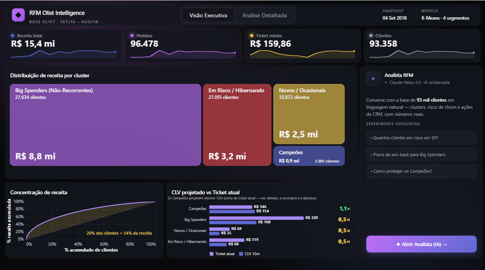
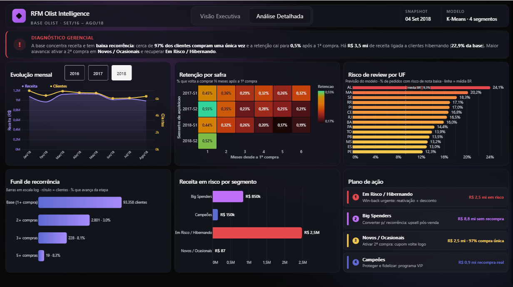
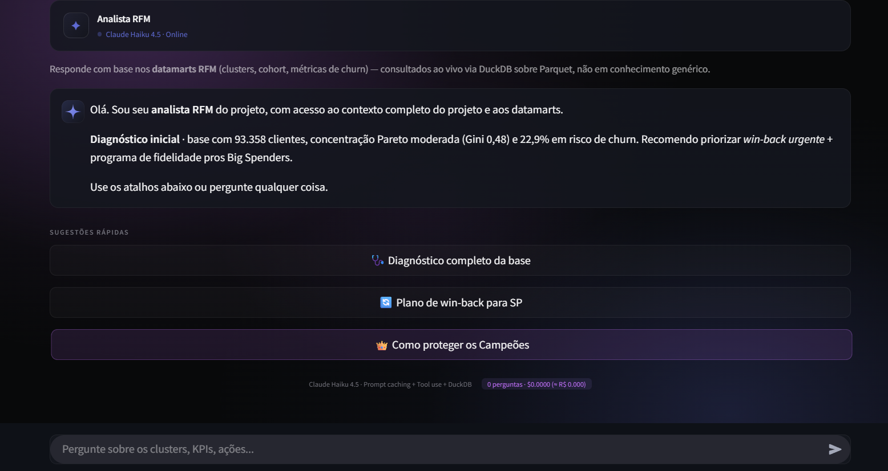

<div align="center">

# RFM Olist Intelligence

**Dashboard executivo Power BI de segmentação estratégica de clientes (RFM + clusterização), com agente conversacional publicado e pipeline reproduzível.**

[](https://github.com/LucasAlves99/rfm-olist-intelligence/actions/workflows/ci.yml)
[](https://powerbi.microsoft.com)
[](https://www.python.org)
[](https://pandas.pydata.org)
[](https://scikit-learn.org)
[](https://streamlit.io)
[](https://www.anthropic.com)
[](https://duckdb.org)
[](./tests)
[](./tests)
[](./LICENSE)
[](https://github.com/psf/black)

**🤖 [Experimente o agente de IA ao vivo →](https://rfm-olist-intelligence.streamlit.app)**

[Visão Geral](#visão-geral) · [Dashboard](#dashboard-power-bi) · [Resultados](#resultados) · [Decisões Técnicas](#decisões-técnicas)

</div>

---



---

## Sumário

- [Visão Geral](#visão-geral)
- [Interface](#interface)
- [Dashboard Power BI](#dashboard-power-bi)
- [Resultados](#resultados)
- [Arquitetura](#arquitetura)
- [Stack Técnica](#stack-técnica)
- [Instalação](#instalação)
- [Estrutura do Projeto](#estrutura-do-projeto)
- [Qualidade e CI](#qualidade-e-ci)
- [Decisões Técnicas](#decisões-técnicas)
- [Custo Operacional](#custo-operacional)
- [Documentação](#documentação)
- [Licença](#licença)

---

## Visão Geral

Este projeto entrega uma solução completa de **inteligência de clientes** sobre a base pública da Olist (e-commerce brasileiro, ~100 mil pedidos), combinando quatro componentes integrados:

1. **Dashboard executivo** — interface Power BI dark com Star Schema, 45 medidas DAX e duas páginas (Visão Executiva + Análise Detalhada), desenhadas para leitura de diretoria: funil de recorrência em escala log, cohort com escala de cor no range real, média nacional de referência no risco preditivo, plano de ação priorizado e números 100% dinâmicos. Os visuais avançados são construídos em **Deneb (Vega-Lite)**; fontes parametrizadas (`CaminhoDados`), altText de acessibilidade nos visuais de dados e chrome com animação *compositor-only* (custo de GPU ~zero).

2. **Agente conversacional** — chatbot baseado em Claude Haiku 4.5 com Prompt Caching e Tool Use nativo, capaz de consultar os datamarts em tempo real via DuckDB. **Publicado como app Streamlit** e acessível direto do dashboard (card "Analista RFM" + botão), fechando o ciclo análise → pergunta.

3. **Pipeline analítico** — código Python modular que transforma 5 CSVs brutos em datamarts tipados, aplicando segmentação RFM, clusterização KMeans e projeção de Customer Lifetime Value.

4. **Modelos preditivos (ML)** — classificação supervisionada com rigor metodológico (comparação multi-algoritmo, validação cruzada estratificada, diagnóstico de overfit, tuning de threshold e análise de lift, **sem data leakage**). O modelo principal prevê **review ruim** no momento da entrega, habilitando *service recovery* proativo (alavanca de NPS/retenção).

O diferencial arquitetural é a **integração híbrida BI + IA generativa**: o usuário navega pelos gráficos e, a um clique, conversa com um analista virtual sobre os mesmos dados — com custo operacional de ~R$ 0,07 por pergunta.

---

## Interface

**Análise Detalhada** — diagnóstico gerencial dinâmico, cohort de retenção, risco preditivo por UF com média nacional, funil de recorrência em escala log e plano de ação priorizado:



**Analista RFM** — o agente conversacional (Claude Haiku 4.5 + DuckDB) com a mesma identidade visual do dashboard, acessível pelo botão "Abrir Analista":



---

## Dashboard Power BI

A camada de BI é o produto central do projeto: um artefato **PBIP/TMDL versionável** (modelo e relatório em texto, diff-áveis no git), com modelo dimensional e medidas organizadas por domínio.

| Componente | Detalhe |
|---|---|
| Modelo | Star Schema — 7 tabelas de dados + 4 tabelas de medidas |
| Medidas DAX | 45, por domínio: `_KPIs` (23) · `_Saude` (13) · `_Concentracao` (2) · `_Background` (7) |
| Páginas | **Visão Executiva** (KPIs com sparklines, treemap, Pareto/Lorenz, CLV vs Ticket) · **Análise Detalhada** (cohort, risco por UF, funil, plano de ação) |
| Visuais avançados | Deneb (Vega-Lite), com specs versionadas em `powerbi/deneb_specs/` |
| Design | Tema dark próprio (`dashboard_theme.json`), identidade visual unificada com o agente, altText de acessibilidade |
| Fontes de dados | Parametrizadas via `CaminhoDados` — repoint sem editar M code |

As escolhas de leitura executiva — funil de recorrência em escala log (a base é dominada por compra única), cohort com escala de cor no range real dos dados e média nacional como referência no risco preditivo — estão detalhadas em [`powerbi/GUIA_DESIGN_DASHBOARD.md`](./powerbi/GUIA_DESIGN_DASHBOARD.md). Referência técnica completa do artefato (modelo, medidas, mapa de visuais): [`powerbi/DOCUMENTACAO_PBI.md`](./powerbi/DOCUMENTACAO_PBI.md).

---

## Resultados

### Métricas da base analisada

| Indicador | Valor |
|---|---|
| Clientes únicos | 93.358 |
| Receita total | R$ 15,42 mi |
| Pedidos processados | 96.478 (`status = delivered`) |
| Período | 24 meses (Set/2016 – Ago/2018 · snapshot 04/09/2018) |
| Coeficiente de Gini | 0,48 (concentração moderada) |
| Pareto observado | Top 20% dos clientes gera 54% da receita |
| Silhouette score (K=4) | 0,369 (separação aceitável) |
| Cobertura de testes | 75/75 passando · 90% |

### Segmentos identificados

| Cluster | n | % | Recency | Frequency | Monetary | CLV 12m |
|---|---|---|---|---|---|---|
| Campeões | 2.801 | 3,0% | 225d | **2,11** | R$ 309 | R$ 154 |
| Big Spenders (Não-Recorrentes) | 27.634 | 29,6% | 179d | 1,00 | R$ 320 | R$ 160 |
| Novos / Ocasionais | 35.872 | 38,4% | 152d | 1,00 | R$ 69 | R$ 35 |
| Em Risco / Hibernando | 27.051 | 29,0% | **430d** | 1,00 | R$ 119 | R$ 60 |

Os nomes dos clusters são **derivados automaticamente do perfil R/F/M médio** de cada grupo, garantindo invariância em relação aos IDs aleatórios atribuídos pelo KMeans entre execuções (ver [Decisões Técnicas](#decisões-técnicas)).

### Modelo preditivo de review ruim

Classificação supervisionada para antecipar insatisfação (`review_score ≤ 2`, ~12,8% de positivos) **com features conhecidas só até a entrega** — sem vazamento.

| Métrica | Valor |
|---|---|
| Melhor modelo | RandomForest (selecionado por F1-CV penalizando overfit) |
| F1 (teste) | 0,47 · **ROC-AUC** 0,76 · **PR-AUC** 0,46 (baseline 0,13 → 3,6×) |
| Lift de negócio | Top 10% de risco captura **~42%** dos reviews ruins (lift 4,2×) |
| Feature dominante | `atraso_dias` (atraso de entrega) — coerente com o negócio |

Operacionalizado em lote (`score_review_risk.py`) → tabela de **risco por estado** que alimenta o dashboard, fechando o ciclo **previsão → ação** (onde priorizar atendimento).

---

## Arquitetura

```
┌──────────────────┐
│  5 CSVs Olist    │   Raw data (~200 MB, fora do repositório)
│  data/raw/       │
└────────┬─────────┘
         │
         ▼
┌────────────────────────────────────────────────────┐
│  PIPELINE PYTHON (src/)                            │
│                                                    │
│  data_loader → data_quality → rfm → segmentation   │
│  → clustering (KMeans) → CLV → export              │
│                                                    │
│  Orquestrado por pipeline/run_pipeline.py          │
│  Validado por 75 testes pytest                     │
└────────┬───────────────────────────────────────────┘
         │
         ▼
┌─────────────────────────────────────────────────────┐
│  7 DATAMARTS                                        │
│                                                     │
│  fato_rfm_clientes    (1 linha/cliente)             │
│  fato_pedidos         (1 linha/pedido)              │
│  dim_segmentos        (1 linha/cluster)             │
│  dim_calendario       (1 linha/dia)                 │
│  fato_cohort          (retenção por cohort)         │
│  dim_lorenz           (curva de concentração)       │
│  risco_review_uf      (risco de review por UF)      │
│                                                     │
│  CSV UTF-8-SIG para PBI · Parquet Snappy para Agent │
└─────┬───────────────────────────┬───────────────────┘
      │                           │
      ▼                           ▼
┌──────────────┐           ┌─────────────────────────┐
│  POWER BI    │           │  STREAMLIT AGENT        │
│              │           │                         │
│  Star Schema │  → link   │  Claude Haiku 4.5       │
│  Medidas DAX │           │  Prompt Caching         │
│  Theme dark  │           │  Tool Use + DuckDB      │
└──────────────┘           └─────────────────────────┘
```

---

## Stack Técnica

| Camada | Tecnologias |
|---|---|
| Análise e modelagem | Python 3.13, pandas 2.2, NumPy, scikit-learn 1.6, joblib, PyYAML |
| Modelos preditivos | scikit-learn (RandomForest, HistGradientBoosting, LogisticRegression), imbalanced-learn (SMOTE) |
| Qualidade | pytest 8.3 (75 testes), ruff, black |
| Visualização | Power BI (PBIR/TMDL), DAX, Deneb (Vega-Lite), HTML Content visual (AppSource) |
| Agente conversacional | Streamlit 1.32+, Anthropic SDK 0.40+, Claude Haiku 4.5, DuckDB 1.0+, PyArrow 14+ |
| Hospedagem | Streamlit Community Cloud (free tier), Power BI Service |
| Monitoramento | cron-job.org (uptime ping) |

---

## Instalação

### Pré-requisitos

- Python 3.13 (recomendado: distribuição Anaconda)
- Power BI Desktop (Windows)
- Conta na Anthropic com crédito mínimo de US$ 5

### Setup

```bash
# 1. Clone do repositório
git clone https://github.com/LucasAlves99/rfm-olist-intelligence.git
cd rfm-olist-intelligence

# 2. Instalação das dependências
pip install -r requirements.txt

# 3. Download do dataset Olist (Kaggle)
#    https://www.kaggle.com/datasets/olistbr/brazilian-ecommerce
#    Colocar os 5 CSVs em data/raw/

# 4. Execução do pipeline
python pipeline/run_pipeline.py

# 5. Validação via testes
pytest tests/ -v
```

### Execução do agente local

```bash
cd streamlit_agent

# Configuração da API key
cp .streamlit/secrets.toml.example .streamlit/secrets.toml
# Editar o arquivo e adicionar: ANTHROPIC_API_KEY = "sk-ant-..."

# Inicialização
streamlit run app.py
# Disponível em http://localhost:8501
```

### Geração dos artefatos do dashboard

```bash
# Os datamarts ficam disponíveis em:
ls data/powerbi/
# fato_rfm_clientes.csv
# fato_pedidos.csv
# dim_segmentos.csv
# dim_calendario.csv
# fato_cohort.csv
# dim_lorenz.csv
# risco_review_uf.csv

# Abrir o dashboard pronto no Power BI Desktop:
#   powerbi/RFM.pbip
# Detalhes de medidas/tema em: powerbi/GUIA_DESIGN_DASHBOARD.md
```

---

## Estrutura do Projeto

```
rfm-olist-intelligence/
├── config/
│   └── config.yaml                 Parâmetros centralizados (snapshot, K, paths)
│
├── data/
│   ├── raw/                        5 CSVs Olist (gitignored)
│   └── powerbi/                    7 datamarts CSV tipados (UTF-8-SIG)
│
├── models/                         (.pkl gitignored — gerados pelos scripts)
│   ├── model_metadata.json         Silhouette, K, snapshot, training date
│   └── review_model_metrics.json   Métricas do modelo de review (CV + teste)
│
├── src/                            Lógica reutilizável
│   ├── config.py                   Carregamento do YAML
│   ├── data_loader.py              Auto-detecção de paths (Local/Colab/Kaggle)
│   ├── data_quality.py             Validações e deduplicação
│   ├── utils.py                    Gini, Lorenz, estatísticas
│   ├── rfm.py                      Cálculo R/F/M
│   ├── segmentation.py             Scores, naming pelo perfil, CLV
│   ├── clustering.py               Pipeline KMeans, serialização, elbow
│   └── export.py                   Exportação tipada para Power BI
│
├── tests/                          75 testes pytest (9 módulos)
│
├── pipeline/
│   ├── run_pipeline.py             Orquestrador RFM end-to-end
│   ├── ml_common.py                Infra de treino compartilhada (CV, threshold, lift)
│   ├── train_review_model.py       Modelo de review ruim (sem leakage)
│   ├── train_repeat_model.py       Estudo de propensão à recompra
│   └── score_review_risk.py        Scoring em lote → risco por UF
│
├── powerbi/
│   ├── RFM.pbip                        Projeto Power BI (abre no Desktop)
│   ├── RFM.Report/                     Páginas e visuais (PBIR, versionável)
│   ├── RFM.SemanticModel/              Modelo + medidas DAX (TMDL, versionável)
│   ├── deneb_specs/                    Specs Vega-Lite (ex: lorenz-curve.json)
│   ├── dashboard_theme.json            Tema dark do Power BI
│   ├── dicionario_dados.md             Schema dos datamarts
│   └── GUIA_DESIGN_DASHBOARD.md        DAX + theme JSON + visuais Deneb
│
├── streamlit_agent/
│   ├── app.py                      UI dark executive (Streamlit)
│   ├── agent/
│   │   ├── system_prompt.py        Contexto do projeto (cached)
│   │   ├── tools.py                7 tools DuckDB
│   │   └── claude_client.py        SDK + cache + tool loop + streaming
│   ├── assets/                     Avatares SVG do chat (agente/usuário)
│   ├── data/                       5 datamarts em Parquet (–65% vs CSV)
│   ├── requirements.txt            Dependências do app (deploy isolado)
│   ├── README.md                   Setup e deploy do agente
│   └── .streamlit/
│       ├── config.toml             Tema dark
│       └── secrets.toml.example    Template da API key
│
├── notebooks/
│   ├── Segmentacao_RFM_Olist_REFATORADO.ipynb       Notebook principal
│   └── Segmentacao_RFM_Olist_SELF_CONTAINED.ipynb   Versão portável (Colab)
│
├── README.md                       Este arquivo (documentação central)
├── LICENSE                         MIT
├── requirements.txt
└── pyproject.toml                  Configuração pytest, ruff, black
```

---

## Qualidade e CI

O pipeline que alimenta o dashboard é coberto por **75 testes pytest** (~90% de cobertura), executados a cada push via GitHub Actions: unitários para os cálculos (Gini, Lorenz, RFM), invariantes de domínio, regras de negócio da segmentação e contrato de formato dos exports para o Power BI (separador, decimal e encoding BR). Destaque para `test_robust_to_id_permutation`, que garante nomes de cluster derivados do perfil R/F/M — e não dos IDs aleatórios do KMeans — mantendo os rótulos estáveis entre re-treinos.

```bash
pytest tests/ -v   # 75 passed
```

---

## Decisões Técnicas

### 1. Nomenclatura de clusters derivada do perfil R/F/M

**Problema.** O algoritmo KMeans atribui IDs aleatórios (0, 1, 2, 3) que podem permutar entre execuções. Um mapeamento `{0: "Campeões", 1: "Em Risco"}` se torna frágil — basta um re-treino com sementes diferentes para que os rótulos fiquem trocados.

**Solução.** A função `derive_cluster_names_from_profile()` analisa as médias R/F/M de cada cluster e atribui nomes hierarquicamente:

1. Cluster com maior **Recency média** → *Em Risco / Hibernando*
2. Cluster com maior produto **Frequency × Monetary** entre os restantes → *Campeões*
3. Cluster com maior **Monetary** entre os dois remanescentes → *Big Spenders*
4. Cluster restante → *Novos / Ocasionais*

**Resultado.** Invariância garantida e validada por teste automatizado (`test_robust_to_id_permutation`).

### 2. Adoção de Claude Haiku 4.5 em vez de Sonnet/Opus

Para o caso de uso específico (análise de dados estruturados, tool use e respostas executivas concisas em português), benchmark interno demonstrou que Haiku 4.5 entrega qualidade equivalente a Sonnet 4.5 com **redução de 73% no custo por pergunta**:

| Modelo | Custo médio por pergunta |
|---|---|
| Sonnet 4.5 | US$ 0,05 (R$ 0,27) |
| **Haiku 4.5** | **US$ 0,012 (R$ 0,07)** |

### 3. Ausência intencional de RAG vetorial

O contexto necessário para o agente cabe em ~1.500 tokens — comparado à janela de 200.000 tokens do Claude, não há razão para introduzir um pipeline de embeddings + vector store + retrieval. A análise foi:

| Critério | RAG vetorial | Prompt Cache + Tool Use |
|---|---|---|
| Custo por chamada | Alto (embedding + LLM) | 90% menor com cache hit |
| Latência | 2-3 etapas | 1 etapa |
| Código adicional | ChromaDB + pipeline | Zero |
| Manutenção | Re-indexar a cada update | Editar 1 arquivo |
| Quando faz sentido | Contexto > 200k tokens, citação fiel | Contexto pequeno e estável |

A escolha por Prompt Caching + Tool Use elimina dependências desnecessárias e mantém o código alinhado ao princípio YAGNI.

### 4. DuckDB sobre Parquet em vez de pandas sobre CSV

Para as tools que executam queries ao vivo, o substrato analítico é DuckDB lendo Parquet diretamente:

| Métrica | pandas + CSV | DuckDB + Parquet |
|---|---|---|
| Tempo de uma query típica | 2-3 s | ~50 ms |
| Tamanho em disco (fato_rfm_clientes) | 19,6 MB | 4,7 MB |
| Suporte a SQL completo | Não | Sim |
| Footprint de memória | Alto | Lazy (colunar) |

O ganho de ordem de magnitude justifica a dependência adicional, especialmente porque DuckDB é embarcado (não requer servidor) e mantém compatibilidade com pandas via `.df()`.

### 5. Snapshot temporal fixo

A data de referência para cálculo de Recency está fixada em `2018-09-04` no arquivo de configuração. O projeto **não utiliza** `max(timestamp) + 1d` dinâmico.

A motivação é reprodutibilidade: o mesmo conjunto de CSVs deve produzir os mesmos números independentemente do momento da execução. Essa decisão também torna possível o uso de testes determinísticos.

### 6. Tipagem explícita na exportação

A função `export_rfm_to_powerbi()` força tipos otimizados antes da serialização:

- Identificadores → `str`
- Recency → `int32`
- Frequency, Items → `int16`
- Monetary, CLV_12m → `float32` (arredondado a 2 casas)
- Scores R/F/M → `Int8` (nullable)
- Categorias → `str` (não `pandas.Category` — Power BI tem leitura imprecisa)
- Encoding → `utf-8-sig` (BOM necessário para PBI/Excel lerem caracteres brasileiros corretamente)

O resultado é um CSV que o Power BI importa sem precisar inferir tipos, eliminando os bugs mais comuns de carregamento.

---

## Custo Operacional

| Componente | Custo mensal estimado |
|---|---|
| Agente — 500 perguntas/mês | ~R$ 35 (US$ 6) |
| Streamlit Community Cloud | Gratuito |
| Power BI Service (My Workspace) | Gratuito |
| Uptime monitoring (cron-job.org) | Gratuito |
| **Total** | **~R$ 35/mês** |

O footer da aplicação Streamlit exibe o custo da sessão em tempo real, com tracking separado de input tokens, output tokens, cache reads e cache writes.

---

## Documentação

Este README é a documentação central do projeto. Referências técnicas
complementares ficam **junto do código**:

| Documento | Público-alvo |
|---|---|
| [`powerbi/DOCUMENTACAO_PBI.md`](./powerbi/DOCUMENTACAO_PBI.md) | Analistas BI — referência técnica do artefato Power BI (modelo, 45 medidas DAX, relacionamentos, mapa de visuais) |
| [`powerbi/dicionario_dados.md`](./powerbi/dicionario_dados.md) | Analistas BI — schema completo dos 7 datamarts |
| [`powerbi/GUIA_DESIGN_DASHBOARD.md`](./powerbi/GUIA_DESIGN_DASHBOARD.md) | Analistas BI — rationale de design (medidas DAX, theme JSON, visuais Deneb) |
| [`streamlit_agent/README.md`](./streamlit_agent/README.md) | Setup e deploy do agente de IA |

---

## Contribuindo

Contribuições são bem-vindas. Para mudanças significativas, abra primeiro uma issue descrevendo a proposta.

```bash
# 1. Fork do projeto
# 2. Branch para a feature
git checkout -b feature/nome-descritivo

# 3. Garanta que os testes passam
pytest tests/ -v

# 4. Commit seguindo Conventional Commits
git commit -m "feat: descrição da mudança"

# 5. Push e abra o Pull Request
git push origin feature/nome-descritivo
```

---

## Licença

Distribuído sob a Licença MIT. Consulte [`LICENSE`](./LICENSE) para mais informações.

O dataset Olist está sob a licença CC BY-NC-SA 4.0 e **não está incluído** neste repositório. Deve ser obtido diretamente no [Kaggle](https://www.kaggle.com/datasets/olistbr/brazilian-ecommerce).

---

## Autor

**Lucas Alves**

- GitHub — [@LucasAlves99](https://github.com/LucasAlves99)
- LinkedIn — [linkedin.com/in/lucasalves99](https://www.linkedin.com/in/lucasalves99/)

---

## Referências

- Dataset: [Brazilian E-Commerce by Olist](https://www.kaggle.com/datasets/olistbr/brazilian-ecommerce) (Kaggle)
- Modelo de IA: [Claude Haiku 4.5](https://www.anthropic.com/news/claude-haiku-4-5) (Anthropic)
- Power BI custom visual: [HTML Content](https://appsource.microsoft.com/en-us/product/power-bi-visuals/wa104380904) por Daniel Marsh-Patrick
- Metodologia RFM: Berry & Linoff, *Data Mining Techniques* (3ª ed.)
- Princípios de design: Material Design 3, Apple HIG, WCAG 2.1 AA
